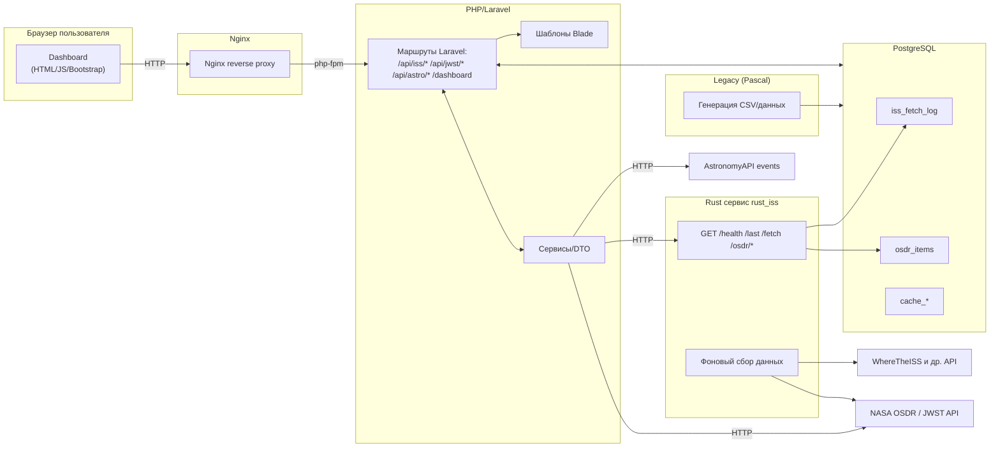

# Введение в проект

Мы компания "Кассиопея" и мы просим вас помочь в оптимизации проекта. На данный момент он выглядит как «распределённый монолит», его основная задача - реализация и сбор данных для космических данных. Наш сервис на Rust собирает внешние данные из открытых API (мы не помним из каких, но оставляем вам все ключи по ним в коде), там же мы пишем их в PostgreSQL и отдаёт REST-эндпойнты для веб-приложения. На фронтенде у нас Laravel, это дашборд с картами, графиками, галереями, где основная часть контента приходит из БД и/или внешних API. У нас есть старая часть, которая используется нами с 2008 года (легаси-модуль), мы его написали не знаем на каком языке, но он периодически генерирует CSV и/или промежуточные данные для БД. Основная БД у нас PostgreSQL. Nginx в качестве прокси.

Ссылка на [gitverse](https://gitverse.ru/stasnorman/he-path-of-the-samurai) изначального проекта.

## Схема взаимодействий



### Легенда карты

- **rust_iss** — rust-сервис: опрос внешних космических API (ISS, NASA OSDR и др.), периодическая запись сырых данных/логов в PostgreSQL, собственные REST-ручки для выборок/триггеров.
- **php_web** — веб-сайт на Laravel + Bootstrap с Dashboard’ами и API-прокси-ручкам
- **iss_db** — PostgreSQL (хранение логов, кэшей и производных данных).
- **pascal_legacy** — легаси-утилита (Pascal), периодически генерирует CSV и/или записи для БД.
- **nginx** — фронтовой reverse-proxy (HTTP 80 → php-fpm).

# Цель рефакторинга

Мы просим вас:
1. Привести в корректное состояние всю архитектуру решения и убрать code smells. Пожалуйста постарайтесь стабилизировать конфиги и точки интеграции - некорректно работает, жалуются пользователи.
2. Ввести единые практики ошибок, логов, кэшей и тестов в виде тестовых сценариев.
3. Сохранить текущую бизнес-функциональность и все страницы и дашборды. Разрешается переход на свой стек, но его нужно объяснить в отчете.

> **Важно (это уже требование СЕ):** функциональный охват не меняем. Любые визуальные улучшения допустимы, но **поведение API и страниц остаётся совместимым** (см. сценарии приёмки в конце).

---

Мы часто общаемся с командами и точно знаем, что существуют какие-то паттерны, которые повышают производительность и есть алгоритмы которые ускоряют обработку. Можете, пожалуйста, добавить их? Просто хотелось бы увидеть зрелое и полное контекстом решение в бизнесе. 

Вам необходимо проверить как работает наш набор сервисов и дать обратную связь в виде диаграмм, блок-схем, тестов. Давайте про каждый поговорим rust_iss (Axum + SQLx). В нём у нас должен был быть следующий подход в плане работы. Не знаем точно, но вроде программист всё сделал, а он: ввести слои `routes/`, `handlers/`, `services/`, `clients/`, `repo/`, `domain/`, `config/`. Организовал вроде даже какую-то DI через `AppState`: `PgPool`, но это не точно и мы до конца не знаем. Пожалуйста, проверьте? Так же проблема может быть в настройке внешних URL (ключей) и таймауты - какие моменты там могут быть, какие сложности, поделитесь вашим экспертным мнением? Хендлеры у нас принимаются через `State<AppState>` и возвращаются в `Result<Json<T>, ApiError>`, так ли это? Может стоит переехать на другой стек?. Наш клиент состоит из модулей ISS, OSDR, JWST, AstronomyAPI и чтобы нас их сервисы не забанили мы установили таймауты, какими-то ретраями и обработку в юзер-агенте. Мы сторонники чистой архитектуры и поэтому вся работа с БД состоит из: работы с репозиториями в `IssRepo`, `OsdrRepo`, `CacheRepo`. Никаких SQL в хендлерах. У нас очень чёткие типы для `fetched_at`, `updated_at` или нет, нужно проверить, напишите отзыв для TIMESTAMPTZ с `DateTime<Utc>`. Кстати, расскажите чем Upsert по бизнес-ключам отличается от (вместо) слепых INSERT? Проект выполняется в фоновом режиме и наш планировщик обрабатывает все интервалы из `env`, сделали защиту от наложения (mutex/pg advisory lock), настроили rate-limit для внешних API.

**Очень хотим видеть единый формат ошибок:**
```json
{ "ok": false, "error": { "code": "UPSTREAM_403", "message": "...", "trace_id": "..." } }
```

- Ожидаем всегда HTTP 200 для предсказуемости, а на сторону клиента отдадим поле `ok=false`. Подготовьте где и как это работает в вашем отчете.

В вебе вам нужно улучшить читаемость и расширяемость кода. Говорят, что у нас там нужно убрать бизнес-логику из контроллера, может стоит переписать или достаточно определить корректный принцип чтобы хоть как-то нормализовать работу с внешними API? Ресурс висит и это видно на основном сайте (скажите что у нас стоит улучшить чтобы повысить производительность): [Space Dashboard](http://95.163.232.216:8080/dashboard). У нас нет никаких SQL/HTTP в Blade, мы используем в представлении и передаём только ViewModel и может иногда DTO. Расскажите о вашем экспертном мнении, что лучше использовать? Наши программисты реализовали таймауты и ретраи, как единые ошибки. Внесите паттерн проектирования для работы с системой, чтобы разделить слой доступа к данным и внешних API.  Обязательно при выборе паттерна ориентируйтесь на повышение тестируемости и это нам должно позволить легко менять источники данных (например, JWST в AstronomyAPI).

Наш родной и близкий сердцу блок легаси, который мы не знаем как называется и возможно вы дадите нам ответ на вопрос - что же это такое?? В общем нам нужно чтобы он был обёрнут и переписан на более нужный и востребованный в отрасли стек, но обязательно нужно учитывать что название, логика методов и алгоритм сохранились. Пакожите как будеет выгалдеть весь этот код.**(Харошо, богажем)** Коротко о нём — обенруть в конетйнер с явным распсианием cron и entrypoint, логи писать в stdout и stderr, формаат CSV и таблчной записи — задокумнетироваьт. Пожалйуста, просим вас подгтовоить план замены на маленаький CLI-микросервсис на Go Rust Python с тем же кнотрактоом. Для базы данных вам нужно разгрузить основную БД и ускорить работу фронтенда без переписывания логики. 

# Общие правила (на что обращаю внимание при проверке):
- Любые изменения должны быть **только** через **Docker Compose**, ваш образ должен собираться «**с** **нуля**».
- Для производительности можете использовать **кэширование**, но только там где уместно (читать раздел «Паттерн для производительности»).
- **ОБЩИЕ ТРЕБОВАНИЯ НА БЕЗОПАСНОСТЬ**: не хардкодить секреты; .env/секреты в Docker; sanitize входные параметры; защита от N+1, SQL-инъекций, XSS/CSRF.
- **Нужно краткое описание проекта** и состава модулей до и после рефакторинга.
- Составить таблицу: модуль, проблема, решение, применённый паттерн, эффект (равное 120 символам).
- Внести выводы и рекомендации какие улучшения реально повлияли на систему и подтвердить всё ссылкой на решение в git.
- В отчете по приложению должны быт скриншоты интерфейса, выдержки из кода, фрагменты логов.